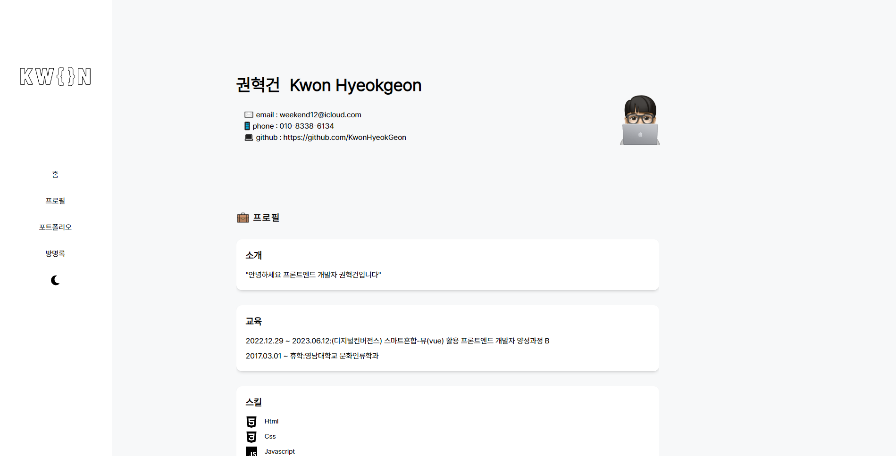

# 프로젝트 이름

   
  포트폴리오 사이트 제작

  
   

## 프로젝트 소개

프로젝트 개요
 
포트폴리오 사이트를 노션과 유사한 레이아웃으로 제작했습니다.

 

## STACK

Vue
 
TailwindCSS
 
Firebase
 
dotenv

## 구현 기능

### 기능 1
사이드 네비게이션의 메뉴를 클릭하여 이벤트를 전달하고 getBoundingClientRect로 해당 위치로 스크롤 이동하게 구현했습니다.
### 기능 2
vueuse를 사용하여 다크모드 기능을 구현했습니다. 
 
import { useDark, useToggle } from "@vueuse/core";
### 기능 3
Firebase를 사용하여 방명록기능을 구현했습니다. realtime database를 사용하여 글을 작성하고 전송버튼을 클릭하면 별도의 라우터 이동 및 새로고침없이 게시판에 노출됩니다.
### 기능 4
dotenv를 .env파일에 Apikey를 변수로 설정하여 숨김처리했습니다.

 

